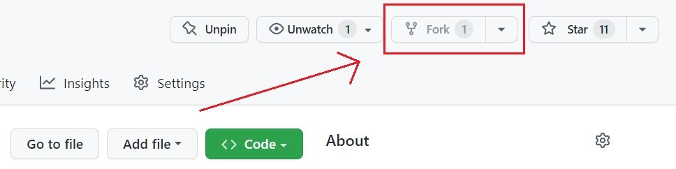

### 📌 Preview

  

### 📌 Website

https://jaenfigueroa.github.io/JaenCraft/

### 🚀 Contributions

Contributions are always welcome and recommended! Here is how:
- Fork the repository

  

- Clone to your machine 
- Create a new branch 
`git clone https://github.com/jaenfigueroa/JaenCraft.git`
- Make your changes
- Create a pull requets
